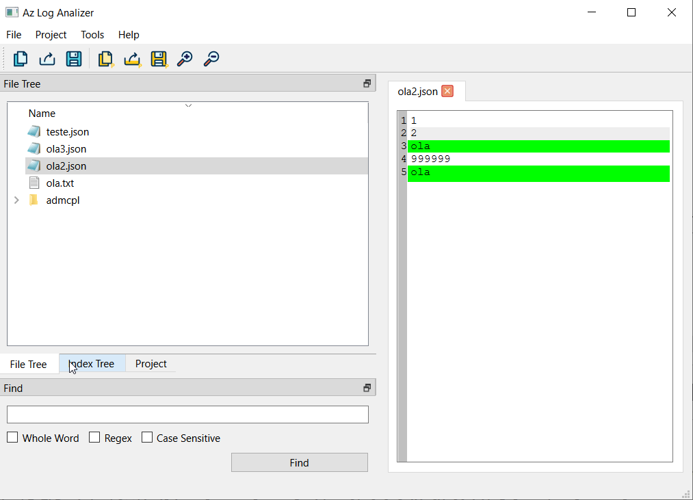
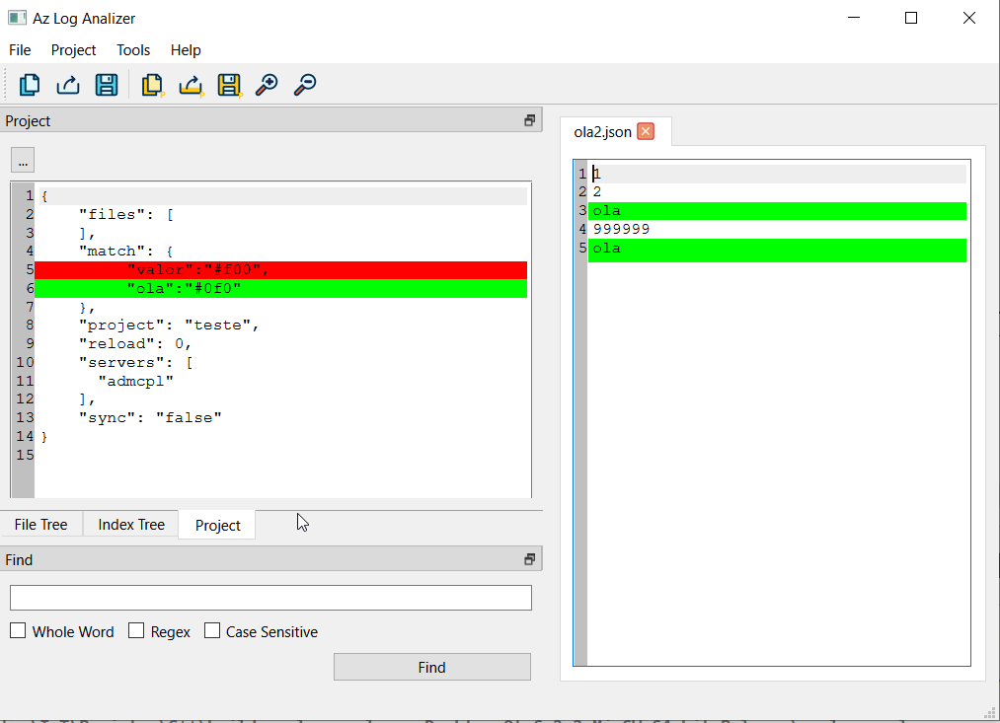

# AZ-log-Analyzer

AZ-log-Analyzer is a system for log visualization build with QT6.2:

## Features:

The system has the following features:
  * Line coloring through predefined patterns (text/color)
  * Organization of the patterns in a projects hierarchy
  * Basic text editing features

